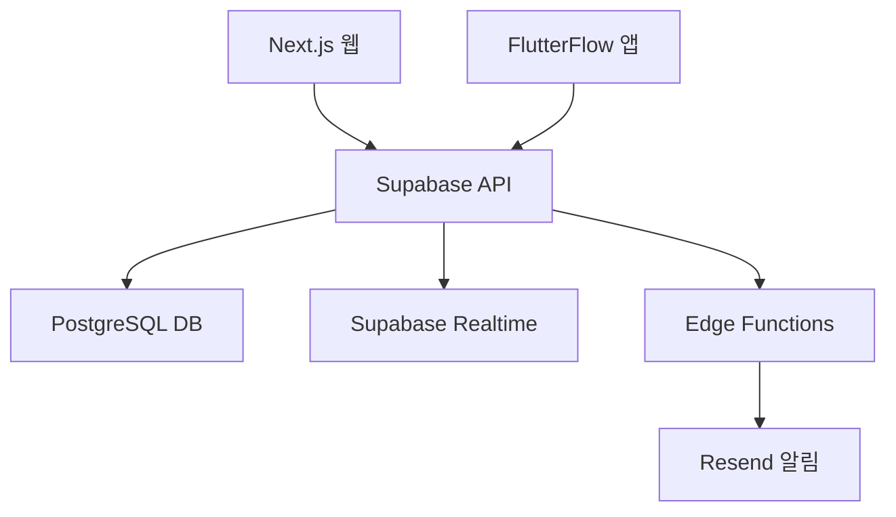

# Technical Requirements Document (TRD)

## 1. Executive Technical Summary

- **프로젝트 개요**  
  CareCycle MVP는 정신건강의학과 의료진 및 행정 직원의 검사·주사 일정 관리 업무를 자동화하여 반복 작업 부담을 최소화하는 웹·모바일 애플리케이션입니다. Next.js(웹), FlutterFlow(모바일), Supabase(PostgreSQL 기반 백엔드)를 중심으로 단순하고 유지보수 용이한 구조로 설계합니다.

- **Core Technology Stack**  
  - 프론트엔드(Web): Next.js + shadcn/ui  
  - 프론트엔드(Mobile): FlutterFlow  
  - 백엔드/API: Supabase (Auth, Realtime, Edge Functions)  
  - 데이터베이스: Supabase(PostgreSQL)  
  - 배포: Vercel  
  - 알림: Supabase Edge Functions + Resend  

- **Key Technical Objectives**  
  - 응답 시간: 평균 200ms 이하(페이지 전환/알림 트리거)  
  - 가용성: 99.9% 이상  
  - 확장성: 초기 500명 사용자, 향후 수천 명 확장 대비  
  - 보안: RLS 적용, HTTPS 전송, 인증·인가 강화

- **Critical Technical Assumptions**  
  - EMR 연동은 MVP 제외  
  - 비개발자도 사용 가능한 UI/UX  
  - Supabase 및 Vercel 기반 배포·호스팅  
  - 외부 리소스 추가 연동 최소화

## 2. Tech Stack

| Category             | Technology / Library                    | Reasoning (선택 이유)                                            |
| -------------------- | --------------------------------------- | --------------------------------------------------------------- |
| Web Frontend         | Next.js                                  | SSR/SSG 지원, Vercel 최적화, 빠른 개발 생산성                  |
| UI Library           | shadcn/ui                                 | Tailwind 기반 컴포넌트 제공, 직관적 디자인 구현                |
| Mobile Frontend      | FlutterFlow                              | 노코드/로우코드 모바일 앱 신속 개발, 비개발자용 UX 쉬움       |
| Backend / API        | Supabase                                 | 서버리스 PostgreSQL, Auth·Realtime·Edge Functions 통합        |
| Database             | Supabase (PostgreSQL)                    | 완전 관리형 DB, RLS로 데이터 분리·보안 강화                   |
| Authentication       | Supabase Auth                            | 이메일/패스워드 기반 간편 인증, JWT 토큰 관리                 |
| Real-time            | Supabase Realtime                        | WebSocket 기반 실시간 업데이트, 간단 구독 모델                |
| Notification Service | Supabase Edge Functions + Resend         | 서버리스 함수로 푸시·이메일 알림, 외부 종속성 최소화           |
| Deployment           | Vercel                                   | Next.js 배포 최적화, CI/CD 자동화, 무중단 배포 지원            |

## 3. System Architecture Design

### Top-Level building blocks
- Web Frontend (Next.js on Vercel)  
  • 페이지 라우팅, 서버 사이드 렌더링, API 호출  
- Mobile Frontend (FlutterFlow)  
  • 모바일 네이티브 UI, Supabase SDK 연동  
- Backend & API (Supabase)  
  • Auth, Database, Realtime, Edge Functions  
- Database & Realtime (PostgreSQL + Realtime)  
  • 일정 데이터 저장, 실시간 업데이트 알림  
- Notification Service (Resend via Edge Functions)  
  • 이메일/푸시 알림 발송 로직  

### Top-Level Component Interaction Diagram


- Next.js 및 FlutterFlow가 Supabase API를 통해 인증, 일정 조회/수정 요청을 수행  
- Supabase는 PostgreSQL에 데이터를 저장·조회하고 Realtime으로 업데이트 전파  
- Edge Functions가 알림 트리거를 처리하여 Resend로 이메일/푸시 발송  

### Code Organization & Convention

**Domain-Driven Organization Strategy**  
- 도메인 분리: 일정 관리, 사용자, 알림 등 비즈니스 도메인별 모듈화  
- 계층 구조: Presentation(웹/모바일 UI), Application(비즈니스 로직), Infrastructure(Supabase 연동)  
- 기능 기반 모듈: 반복 업무, 체크리스트, 대시보드 등 기능 단위로 파일 그룹화  
- 공유 컴포넌트: 공통 유틸리티, 타입, 인터페이스를 shared 모듈에 배치  

**Universal File & Folder Structure**
```
/
├── apps
│   ├── web
│   │   ├── pages                  # Next.js 페이지 라우트
│   │   ├── modules                # 도메인별 기능 모듈
│   │   ├── components             # UI 컴포넌트
│   │   ├── lib                    # Supabase 클라이언트 등 라이브러리
│   │   └── styles                 # 전역 스타일
│   └── mobile                     # FlutterFlow 프로젝트 디렉토리
├── services
│   ├── supabaseClient.ts          # Supabase 초기화 및 설정
│   └── notifications.ts           # Edge Functions 알림 로직
├── shared
│   ├── types                      # 공통 타입 정의
│   └── utils                      # 범용 유틸리티 함수
└── README.md
```

### Data Flow & Communication Patterns
- **Client-Server Communication**: Next.js API Routes, FlutterFlow HTTP 요청 → Supabase REST/JS SDK  
- **Database Interaction**: Supabase JS SDK 이용한 CRUD, 쿼리 빌더, 인덱스 활용  
- **External Service Integration**: Supabase Edge Functions에서 Resend API 호출  
- **Real-time Communication**: Supabase Realtime 구독으로 데이터 변경 알림 반영  
- **Data Synchronization**: 클라이언트 캐시 + Realtime 업데이트로 일관성 유지  

## 4. Performance & Optimization Strategy
- 서버사이드 렌더링(SSR) 및 정적 생성(SSG) 활용으로 초기 로딩 속도 향상  
- Supabase 쿼리 튜닝 및 인덱스 적용으로 DB 응답 시간 최소화  
- 코드 스플리팅 및 레이지 로딩으로 번들 크기 축소  
- 클라이언트 캐싱 전략(브라우저 캐시, SWR) 적용  

## 5. Implementation Roadmap & Milestones

### Phase 1: Foundation (MVP Implementation)
- Core Infrastructure: Supabase 프로젝트, Vercel 연동, FlutterFlow 초기 설정  
- Essential Features: 환자 일정 자동 계산, 일별 체크리스트, 알림 트리거, 대시보드  
- Basic Security: Supabase Auth, RLS 정책, HTTPS 강제화  
- Development Setup: Git 레포 구성, Vercel Preview, Supabase CI/CD  
- Timeline: 4주

### Phase 2: Feature Enhancement
- Advanced Features: 사용자 정의 항목 추가, 메모 기능 강화  
- Performance Optimization: 쿼리 인덱스 추가, CDN 적용  
- Enhanced Security: 세션 타임아웃, 역할 기반 접근 제어 기초  
- Monitoring Implementation: Sentry, Supabase Analytics 대시보드  
- Timeline: 3주

### Phase 3: Scaling & Optimization
- Scalability Implementation: Read Replica, 캐시 레이어 도입  
- Advanced Integrations: SMS/푸시 알림 확장, EMR 연동 준비  
- Enterprise Features: 다중 사용자, 세부 권한 설정  
- Compliance & Auditing: 감사 로그, RLS 강화  
- Timeline: 4주

## 6. Risk Assessment & Mitigation Strategies

### Technical Risk Analysis
- Technology Risks  
  • FlutterFlow 기능 한계로 복잡 UI 구현 어려움 → 사전 프로토타이핑  
- Performance Risks  
  • Supabase 단일 DB 병목 → 인덱스, 캐시, Read Replica 준비  
- Security Risks  
  • 인증/인가 누락 가능성 → RLS 정책, 정기 보안 점검  
- Integration Risks  
  • Resend 지연·실패 → 재시도 로직, 백오프 전략

### Project Delivery Risks
- Timeline Risks  
  • 요구사항 변경 → 명확한 마일스톤·스코프 관리  
- Resource Risks  
  • FlutterFlow·Supabase 경험 부족 → 내부 워크숍, 문서화  
- Quality Risks  
  • 테스트 부족으로 버그 잔존 → 자동화 테스트, 코드 리뷰  
- Deployment Risks  
  • Vercel 배포 실패 → 스테이징 환경, 롤백 절차 마련  
- Contingency Plans  
  • 알림 대체 서비스(SMS 등) 준비, 노코드 플랫폼 대체 방안 확보  